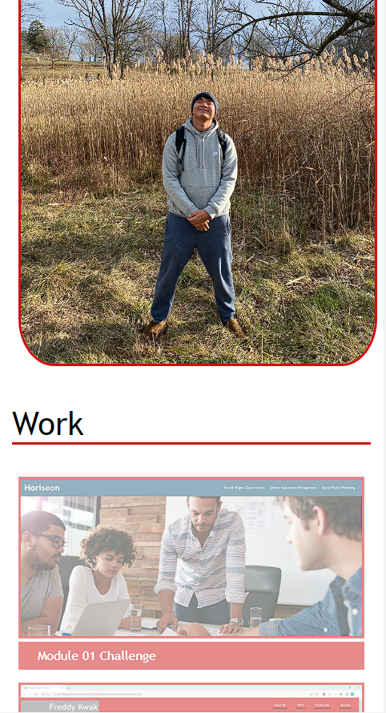

# Personal-Portfolio

## Table of Contents
- [Description](#description)
- [Usage](#usage)
- [Desktop-Screenshots](#screenshots-at-desktop-size)
- [Tablet-Screenshots](#screenshots-at-tablet-size)
- [Mobile-Screenshots](#screenshots-at-mobile-size)
- [Credits](#credits)
- [Link](#link-to-deployed-application)

## Description

The Module 2 challenge was to create a portfolio site that consisted of a header with my name and a navigation bar, a subtitle section, an "About Me" section, a "Work" section, and a "Contact Me" section - in that order from top to bottom.

The reason for creating a portfolio was to develop a website where I could showcase my previous work and learned skills to possible future employers after the UPenn LPS bootcamp is over. In order to successfully find employment, I must have several projects deployed and accessible through this portfolio website. The more projects we create, the more content my portfolio will have, the better chance at employment I have.

I was able to learn more about and become more comfortable with media queries, flexbox, CSS grids, and defining/applying CSS variables throughout this challenge.

## Usage

1. First, clone the repository from GitHub from the repository homepage onto your device.

2. Use $ git pull in your Git Bash or terminal to pull the materials from the repository onto your device.

3. Open the index.html from the repository in VS Code or code editor of your choosing.

4. Open the index.html file in your default browser.

## Screenshots at Desktop Size

### Screenshot #1:

### Screenshot #2:

### Screenshot #3:

## Screenshots at Tablet Size

### Screenshot #1:

### Screenshot #2:

### Screenshot #3:

## Screenshots at Mobile Size

### Screenshot #1:

### Screenshot #2:

### Screenshot #3:

### Screenshot #4:

## Credits

### Special Thanks to:

Sean Dillon https://github.com/DeviousDoge/

### Links Used for Reference:

http://html5doctor.com/html-5-reset-stylesheet/

https://www.freecodecamp.org/news/css-media-queries-breakpoints-media-types-standard-resolutions-and-more/

https://www.w3schools.com/css/css3_images.asp

## Link to Deployed Application

https://fredkk22.github.io/Personal-Portfolio/